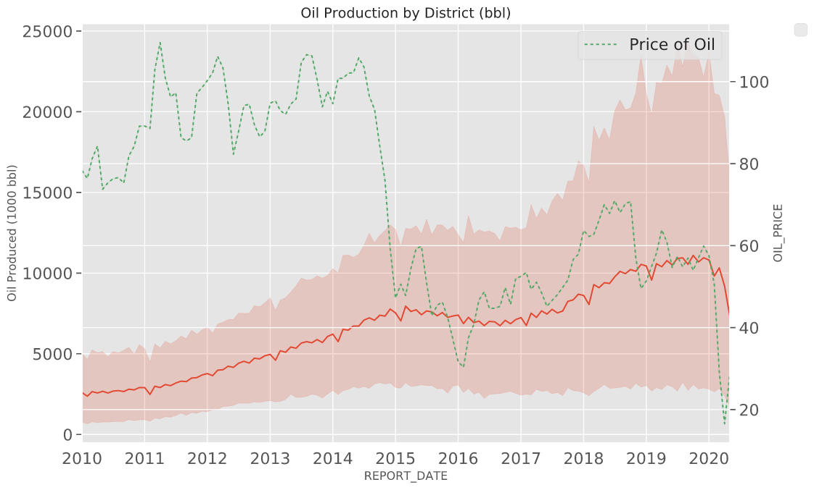

# Flare-Factor

Deploy Machne Learning technologies, trained on publically avaiable data from the Texas Railroad Commission, to predict flaring volumes for oil and gas leases in Texas.

  

## Why Flaring
Flaring, the burning of natural gas that is more expensive to get to market than to burn, has been a decades-long concern for environmental groups, and a frustrating problem for those who understand the energy industry. In my many years working in the oil and gas industry, I always understood why flaring happened and the cost/benefit of doing so - but it always bothered me. In my previous project I sought to quantify flaring energy wasted at the state level, and put it into perspective. Knowing the opportunity cost of the energy wasted inspired me to keep digging.  Many enterprising groups are developing innovative solutions for using the energy wasted to flaring. Identifying, locating and quantifying current flaring levels and locations is a cumbersome challenge with hundreds of thousands of wells reporting production and flaring monthly. This project will lay the ground work for building a 'marketplace' for current flaring energy in Texas by investigating the feasibility of *predicting* flaring levels down to the lease level. 

## The Tech

## The Data
As previously mentioned, the Texas Railraod Commission (TRRC) dumps all the data they collect monthly. This amounts to about 135,000 reports monthy in 2019/2020 from all active leases in Texas. The unzipped dataset exceeds 25 GB, and contains upwards of 65,000,000 entries for production and ~35,000,000 entries that contain information on flaring, dating back to 1993. After initally reading in the full dataset, I determined that there was a good reason to focus on 2010 - Present data, as there is a clear departure from what was the normal in 2010, made evident in the plot below. 

  
  

The year 2010 is significant because it represents the year when shale oil revolution (crude oil extraction from non-permeable formations),  truly began in Texas. This move expanded the boundaries of where oil production was possible, which in turn expanded where flaring would occur. The increasing production of oil from locations further removed from any sort of gas processing facility or market for the gas has led to a massive increase in flaring volumes, and a 'new normal' in Texas. One important feature about the data: every volume is self-reported by the operating companies the the TRRC. 

## First Approach
I have a great deal of domain knowledge in the Oil & Gas industry, so I understood inherently what features would weigh heavily on the flaring volumes observed each month. The first phase was to digest the mass quantity of data received from the TRRC, and create a reliable pipeline of the features I wanted to keep. Below is a summary of what features I included in my analysis and if they were engineered or taken directly from TRRC data. 

|Feature      | Description | Units   | Feature Engineering |
| ----------- | ----------- |---------| ------------------- |
|District     | TRRC Regional District | ID Number | Pulled straight from TRRC. District is the highest level geographical category.|
|County       | Name and ID number of County in Texas | Name / ID Number | Pulled straight from TRRC. Further classifies the lease geographically. |
|Operator     | Name and ID number of the company listed as the Operator | Name / ID Number | Pulled straight from TRRC. Company reporting the production / flaring. |
|Lease        | ID number of lease | ID Number |  Pulled straight from TRRC. Most granular geographical classification. Lease will be used to concatenate the lease location with the latitude / Longitude shape files.|
|Oil Produced | Volume of oil produced on the lease in the given year / month | Barrel (bbl) |   Pulled straight from TRRC |
|Gas Produced | Volume of natural gas produced on the lease in the given year / month | Thousand cubic feet (Mcf) |    Pulled straight from TRRC. natural gas withdrawn from the hydrocarbon reservoir |
|Casinghead  Gas Produced | Volume of casinghead gas produed on the lease in the given year / month | Thousand cubic feet (Mcf) |  Pulled straight from TRRC. Natural gas produced along with crude oil from oil wells. It contains either dissolved or associated gas or both  |
|Condensate produced | Volume of condensate produced on the lease in the given year / month | Barrel (bbl) |   Pulled straight from TRRC. Low-density mixture of hydrocarbon liquids that are present as gaseous components in the raw natural gas produced from the reservoir|
|Flaring Volume | Volume of gas flared or vented on the lease in the given year / month | thousand cubic feet (Mcf) |    Pulled straight from TRRC. This is the amount of energy wasted, and the focus of this project |
|Months from First Report| Tracking how many reporting periods have passed from first reporting production | Number of months | With this feature I wasnted to capture the effects of decaying production over time. I simply converted all month / year entries from type(int) to datetime, the subtracted the current report date from the first report date.|
|Price of Oil | Dollars per Barrel in the given year / month | USD | Price of oil informs the oil produced. Oil produced informs the flaring volume. Created web scraping script to concatenate the year / month with the average price for the given cycle. Also includes availablility to include forecasted oil prices in the future. 

## Data: Additional Considerations

While I will investigate flare volumes in an absolute sense (i.e pure flare volume), it is important to understand that flaring only ocurrs becuase oil and gas are produced. If there is a lease that produces more oil than another one, it is likely that there will be more flaring. to account for this, I created some factors that will better depict the 'energy stewardship' of a particular lease. A few terms that will be introduced to account for this:
  1. **Waste ratio**: This is a unit-less metric that will capture, from a pure chemical potential energy standpoint, how much energy (in kilo-watt of giga-watt hours) was vented or flared, over total energy produced (in kwH of Gwh) from a combinatino of oil, gas and condensate. 
  2. **Flaring Intensity**: This will capture the flaring volume (Mcf) as a factor of oil produced (in bbl). Becuase oil production is the main target of production in Texas, it will weigh most geavily on the flaring volumes. 
  
  These ratios will illuminate areas that may flare less gas, but are in fact more wasteful as a factor of how much is produced. 
  
 ## EDA: Finding the Variance
 
 ### District Level
  
 - The Boxplots break down the aggregate production and flaring values by district  
 - Also provided the flariring volumes normalized by both oil production and gas production
 - Normalized values show which districts are better than other at handling the gas

 
   

   
  

  
  

### Follow the Money

 
   

   
  

  
  

